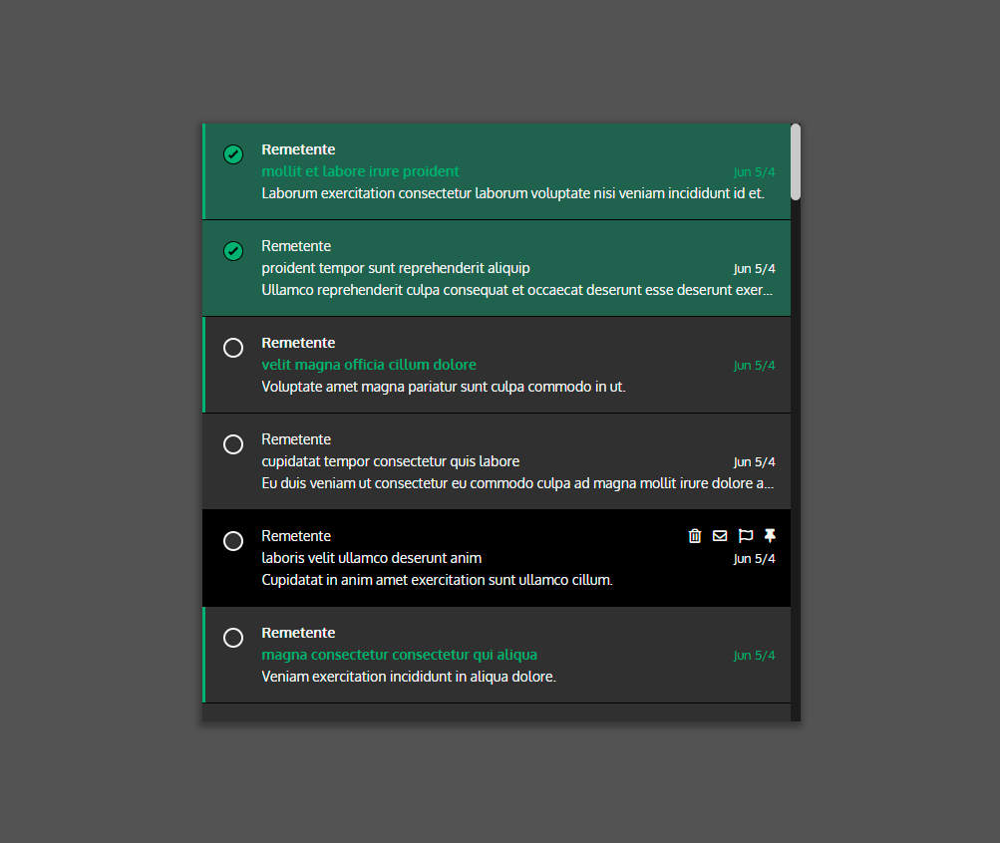

<h2 align="center">
	Front End Challenge
</h2>



## 📙 Overview

As per the [challenge description](https://github.com/EnkiGroup/DevPlenoTest/blob/master/README.md), the goal of this project was to create a small component based on Office365's email application. Some of the functionalities present in this application are:

- **Delete emails.** By clicking on the 'trash bin' icon, the chosen email will be deleted.
- **Toggle 'read' flag.** Besides marking the email as read by clicking anywhere in its area, clicking the 'letter' icon will toggle its 'read' flag.
- **Responsive interface.** It's completely mobile friendly, so it works smoothly on every desktop, smartphone and tablet.

## 🔨 Process

I tried to make it look as similar as possible to the actual Office365 application, so I chose similar fonts and colors for this project.

I ended up using 3 components: **App**, to host the entire application and its logic, **List**, to display every email, and **Item** which is the email itself and its actions.

The JSON that works as API is being fetched using the Axios lib. After being fetched, I'm adding 3 extra properties to each object returned: **read**, **selected** and **showSelector**, each acting as a boolean flag for each email.

**read** is responsible for marking the email as read. **selected** is the flag that indicates that email has been selected. Finally, **showSelector** tells us that an email has to make its checkbox visible.

Curiously enough, my main challenge in this project was the CSS. Since I'm using conditional classes, hover conditions and custom checkboxes, I got a bit overwhelmed. But nonetheless, I'm pretty happy with the result.

Finally, PropTypes were added to the project, with the goal to type check all the props used in the application.

## 🎨 Palette

| Color                            | Hex                             | Color                            | Hex                             |                                                        
| -------------                    |:-------------:                  | -------------                    |:-------------:                  |
|  | #000000 |  | #3E6250 |
|  | #212121 |  | #5AB075 |
|  | #333333 |  | #C8C8C8 |
|  | #545454 |  | #F6F6F6 |
|  | #0077D3 |


## 💾 Getting Started
To build and run this application locally, you'll need latest versions of Git and Node.

```
# Clone this repository
$ git clone https://github.com/msfern/encontact-challenge

# Go into the repository
$ cd encontact-challenge

# Install the dependencies
$ npm install 
$ or
$ yarn

# Start the application
$ npm start 
$ or
$ yarn start
```

## License

This project is licensed under the MIT License - see the [LICENSE.md](LICENSE.md) file for details
